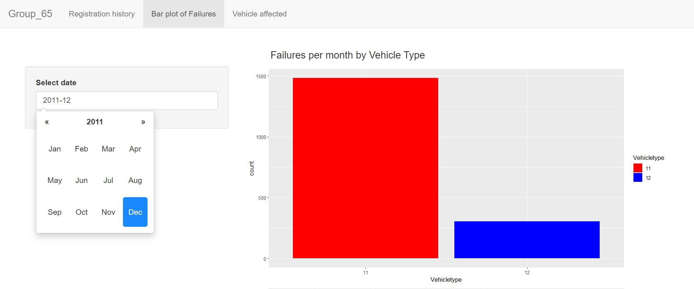

# Data analysis and visualization with R
* Cleaning and Joining of large data set 
* Stastical analysis of logistics delay 

## Example graphic of Statiscal analysis

* creation of interactive Shiny app for user to query database

## Screenshot of shiny app 

